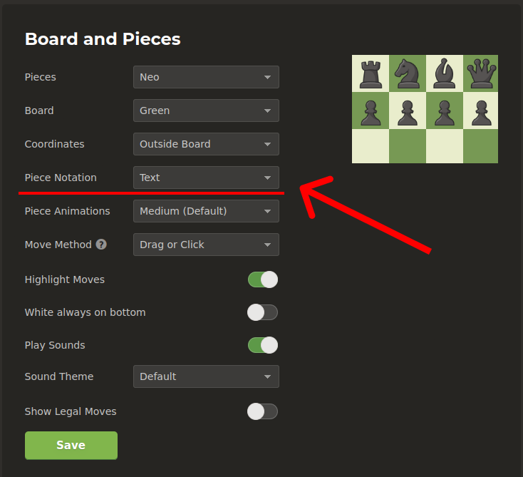

# Chess Spell Moves (CSM)

Chess Spell Moves (CSM) is a Chrome extension designed to assist chess players in visualizing and understanding their moves by providing real-time audio feedback during gameplay on [Chess.com](https://www.chess.com/). CSM spells out the moves played during a chess game, enhancing the player's experience and aiding in chess move comprehension.

## Features

- **Real-time Audio Feedback:** CSM spells out chess moves as they are played, helping players understand the moves in aural form.
- **Enhanced Chess Visualization:** By hearing the moves spoken aloud, players can reinforce their understanding of chess piece movements and their positions on the board.
- **User-Friendly Interface:** The extension integrates seamlessly with the Chess.com interface, ensuring a smooth and intuitive user experience.

## Installation

To install Chess Spell Moves, follow these steps:

1. **Download the Extension:**
   - Clone this repository or download the ZIP file.
   
2. **Load the Extension:**
   - Open Google Chrome.
   - Navigate to `chrome://extensions/`.
   - Enable "Developer mode" in the bottom right corner.
   - Click on "Load unpacked".
   - Select the folder where the extension files are located.

3. **Usage:**
   - Visit [Chess.com](https://www.chess.com/) and play a chess game against a computer.
   - Once the game starts, Chess Spell Moves will automatically spell out the moves as they are played.

## Screenshots

## Known Limitations

- CSM currently works only for games played against the computer on Chess.com.
- Online games functionality will be available in future updates.

## Feedback and Contributions

We welcome your feedback and contributions! If you encounter any issues or have suggestions for improvement, please [create an issue](https://github.com/AudouxH/chess_spell_moves/issues) or submit a pull request.

## License

This project is licensed under the [MIT License](LICENSE).